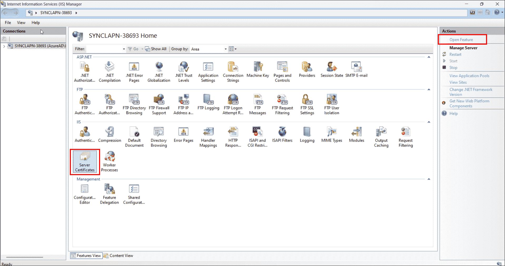
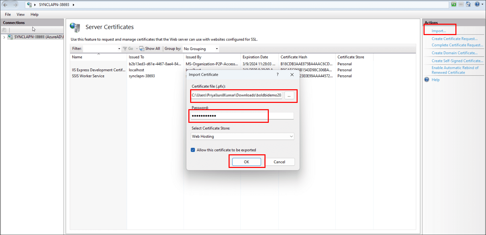
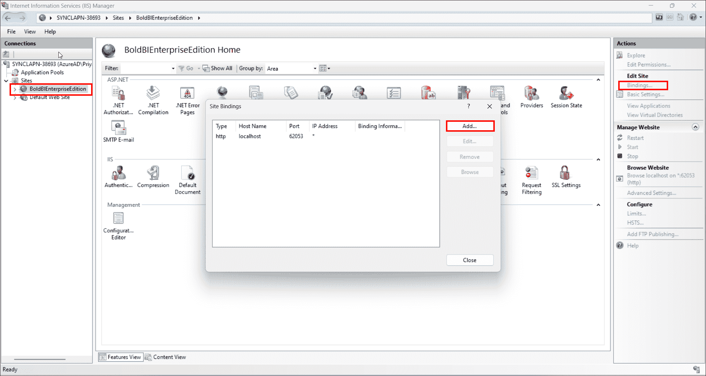
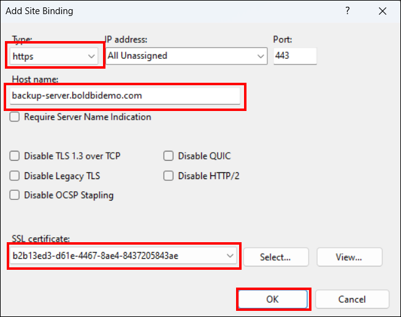
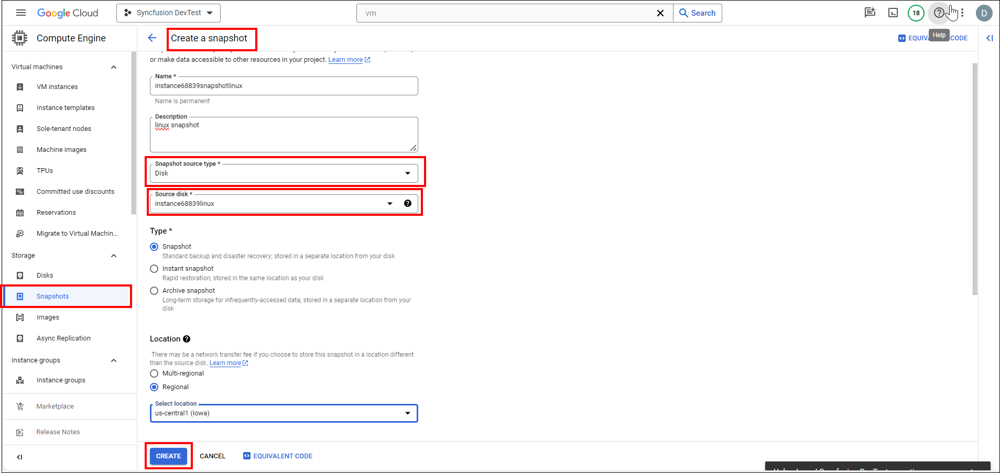
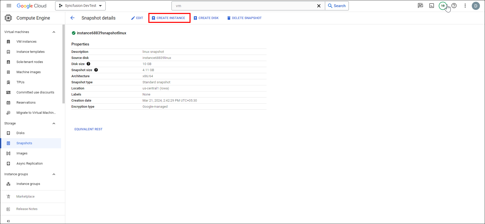
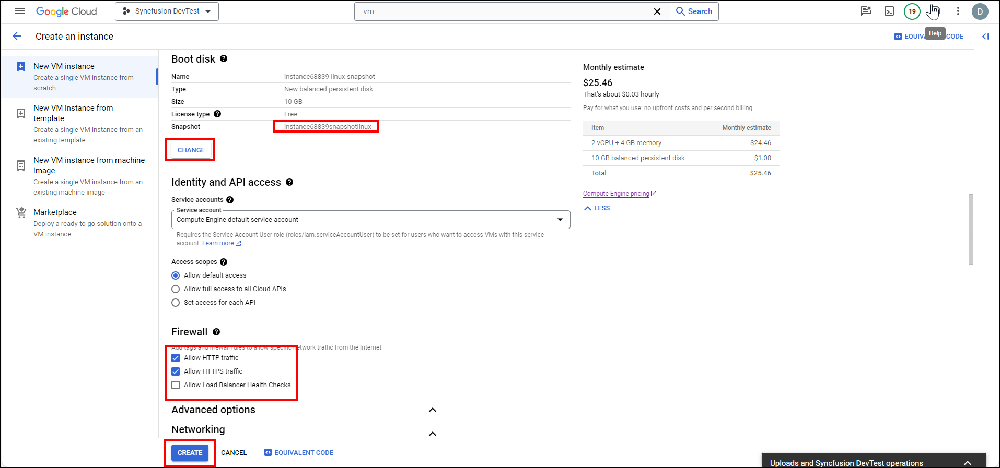
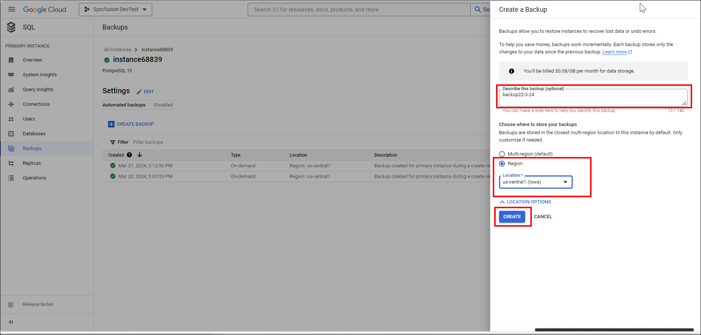
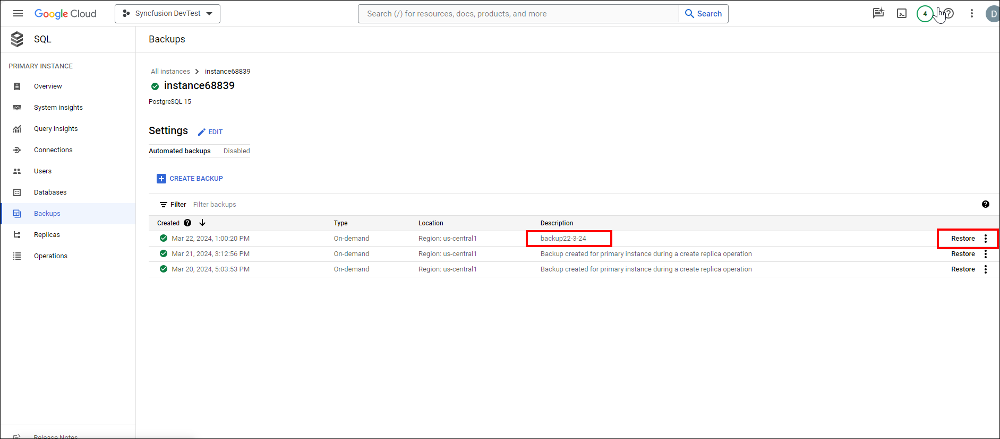
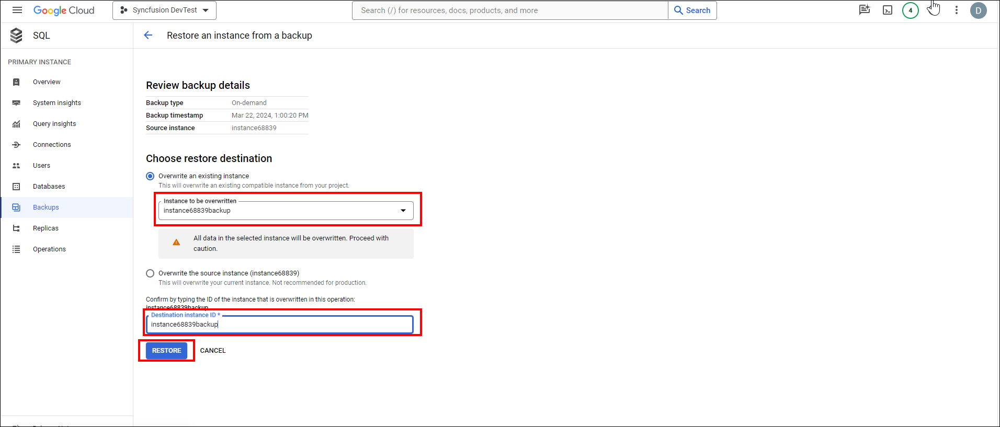

# Steps to Install and Enable Backup Compatibility of Bold BI on GCP Windows instance

| SEO Details       |                                                                     |
|-------------------|---------------------------------------------------------------------|
| Meta Title        | Installing and Enabling Backup Compatibility for Bold BI on GCP Windows instance |
| Meta Description  | Learn how to install Bold BI on GCP Windows instance and enable backup compatibility with easy-to-follow steps. Ensure data protection and disaster recovery for your Bold BI installation. |

## Below are the steps that will help you to install Bold BI.

### 1. Launch an Windows instance on GCP
   - To create an Windows instance in GCP, refer to this [link](https://cloud.google.com/compute/docs/create-windows-server-vm-instance).

### 2. Setup PostgreSQL Database
If you want to set up a PostgreSQL Database on  Windows instance, follow the first step. If you prefer using a managed Database in GCP, follow the second step.

#### a. Setting up PostgreSQL in a Windows instance
- Download the [PostgreSQL installer for Windows](https://www.enterprisedb.com/downloads/postgres-postgresql-downloads) and install it.
- For detailed installation steps, refer to this [guide](https://www.postgresqltutorial.com/postgresql-getting-started/install-postgresql/).

**Information:**
  - For installing a MySQL database in a Windows EC2 instance, refer to the steps outlined in this [guide](https://dev.mysql.com/doc/refman/8.3/en/windows-installation.html).
  - To install an MS SQL database in Windows EC2 instance, follow the instructions provided in this [guide](https://learn.microsoft.com/en-us/sql/database-engine/install-windows/install-sql-server?view=sql-server-ver16).

#### b. Setting up PostgreSQL Database in GCP
- For instructions on creating a PostgreSQL Database in GCP, please refer to this [link](https://cloud.google.com/sql/docs/postgres/create-instance/). Additionally, you can refer to this [link](https://cloud.google.com/sql/docs/postgres/instance-info) for instance information.

**Information:** 
  - To create a MySQL Database in GCP, you can follow the steps outlined in this [guide](https://cloud.google.com/sql/docs/mysql/create-instance). For information about your instance, refer to this [link](https://cloud.google.com/sql/docs/mysql/instance-info).

  - To create a SQL Database in GCP, refer to this [guide](https://cloud.google.com/sql/docs/sqlserver/create-instance). Additionally, for instance information, you can refer to this [link](https://cloud.google.com/sql/docs/sqlserver/instance-info).

### 3. Bold BI Installation

- Features to be enabled in IIS to run Bold BI in Windows Server OS. Refer to this [link](https://help.boldbi.com/faq/features-needed-to-enable-in-iis-to-run-bold-bi-in-win-server-os/).
- You have the option to download various versions of Bold BI from [here](https://www.boldbi.com/account/downloads). you can download and install.
- Follow the steps in the [Bold BI documentation](https://help.boldbi.com/deploying-bold-bi/deploying-in-windows/installation-and-deployment/) to install the BoldBI web application.
- For guidance on startup configuration for Bold BI, please refer to the following link: [Help.BoldBI.com](https://help.boldbi.com/application-startup/latest/)

### 4. DNS Mapping and Binding with Bold BI Application

- Map IP Address to Domain Name
  - Log in to your domain registrar's website.
  - Navigate to the DNS management section.
  - Create an A record that points your domain name to the IP address of your VM.

- Bind the Domain with Bold BI
    - Open IIS Manager and select "Server Certificates" below the server node.
    
    - Click on "Open Feature" to import the SSL certificate. Upload the certificate, enter the password, select the certificate store type, and click "OK".
    
    - Navigate to your "BoldBIEnterpriseEdition" folder in IIS, then click on "Bindings". Click "Add" and select type as "https". Upload the SSL certificate and click "OK".
    
    

    - In the Bold BI Enterprise Edition, go to the right pane. Below the browse website, you can find the domain name you bound. Now you can access the Bold BI application through the domain name.

**Note:**

  If you are configuring DNS mapping for your virtual machine (VM), it's important to also map the snapshot of your VM. 
  
## To Enable Backup compatibility of Bold BI application

### 1. Create a Snapshot of Virtual Machine
-  In the Google Cloud Console, navigate to "Compute Engine" in the left sidebar. Click on the name of the Windows VM instance for which you want to create a snapshot.
- In the left side pane, select the "Snapshots" tab and click on "Create Snapshot". Enter the name of your snapshot and add an optional description. For the source type, select "Disk" since we are taking a snapshot of a disk. Choose the disk you want to snapshot from the "Source disk" dropdown menu. Finally, click the "Create Snapshot" button.In the Location section, choose your snapshot storage location.

- For detailed instructions to create snapshot of your VM, follow the link: [Creating a Windows persistent disk snapshot](https://cloud.google.com/compute/docs/instances/windows/creating-windows-persistent-disk-snapshot)

### 2. Restore the Snapshot of Virtual Machine
- Once you have created the snapshot, it will appear as shown in the image below. Select the "Create instance" button at the top. 

-  You can then enter the details for your restored VM, such as the name, CPU, storage, and region.

- In the boot disk section, verify that your snapshot is selected. If it is not selected, you can change it by clicking "Change". Allow the firewall to access the VM, then click the "Create" button.

- For detailed instructions to create snapshot of your VM, follow the link: [Restoring a Windows snapshot](https://cloud.google.com/compute/docs/disks/restore-snapshot)

**Note:** 
  If you are not using a managed database server or an Azure blob container, creating a snapshot of your virtual machine is adequate. You can then proceed to step 4.

### 3.PostgreSQL Backup and Restore in GCP (Managed instance)
- Navigate to your created database. In the left pane, select "Backup" and click the "Create Backup" button. 

-  Fill in details such as description and select the location. Click "Create".

- In the backups tab, locate your backup data. Click "Restore". 

- In the "Instance to be overwritten" column, select the target database instance. Enter the instance ID of the target DB. Click "Restore". 

**Note:**

- Before restoring, ensure that you have a target database instance available.
 

## 4. Reset the Connection string to use restored PostgreSQL Database

- To use the restored database, you'll need to reset the database on your Virtual Machine.
Detailed steps can be found in the following documentation: [Reset Application Database on Windows](https://help.boldbi.com/utilities/bold-bi-command-line-tools/reset-application-database/#windows)

